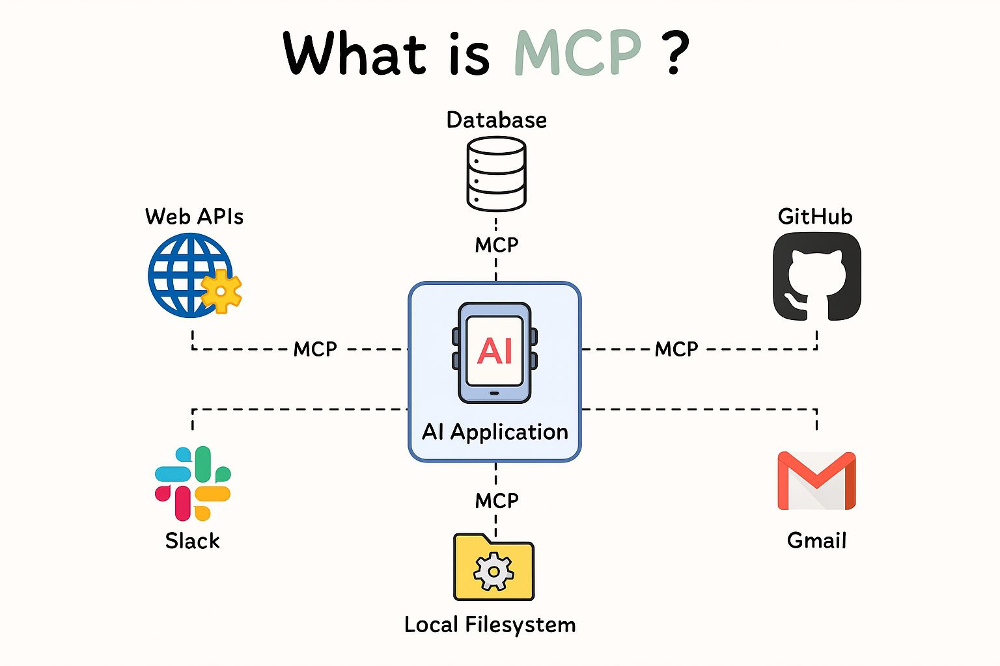
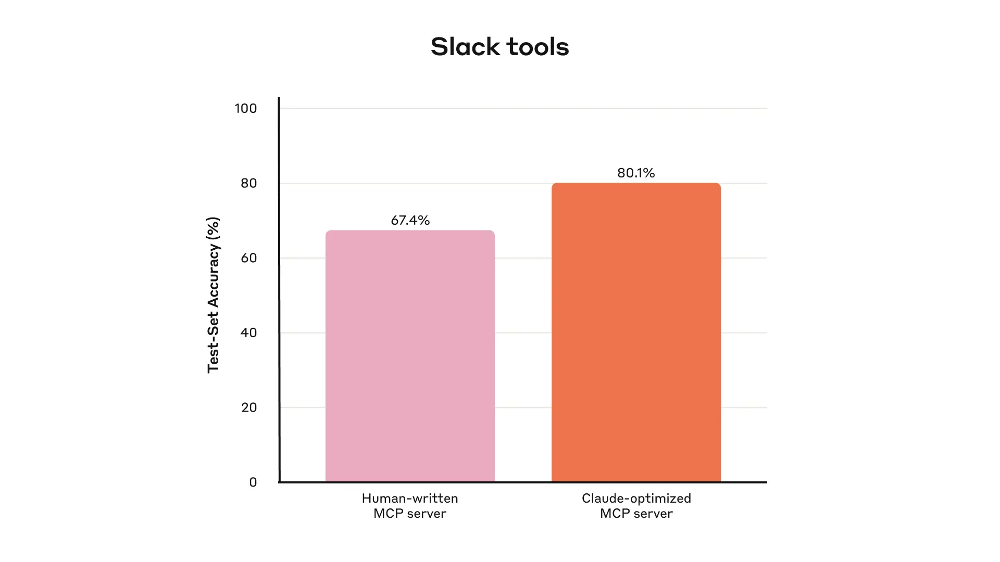

<!-- _class: lead -->

<style>
img[alt~="center"] {
  display: block;
  margin: 0 auto;
}
</style>

# MCP Landscape for Developers


---

<!-- _class: hero -->


## Oleksii Nikiforov

- Lead Software Engineer at EPAM Systems
- AI Coach
- +10 years in software development
- Open Source and Blogging
- <small>Someone who builds MCP Servers used in production 🙂</small>

> <i class="fa-brands fa-x"></i> [@nikiforovall](https://twitter.com/nikiforovall)
<i class="fa-brands fa-github"></i> GitHub: [nikiforovall](https://github.com/nikiforovall)
<i class="fa-brands fa-linkedin"></i> LinkedIn: [Oleksii Nikiforov](https://www.linkedin.com/in/nikiforov-oleksii/)
<i class="fa fa-window-maximize"></i> Blog: [nikiforovall.blog](https://nikiforovall.blog/)

---

# Agenda

<style scoped>
section {
  font-size: 42px;
}
</style>

- Introduction to MCP
- **Writing Effective MCP Tools: Production Best Practices**
- Building MCP Servers with .NET

---

<style scoped>
section {
  background-color: #fffcf6;
}
</style>



---

# What is the Model Context Protocol (MCP)?

> MCP (Model Context Protocol) is an open-source standard for connecting AI applications to external systems.


---
# MCP Servers Features

<style scoped>
div {
  display: grid;
  place-items: center;
}
.mermaid {
  transform: scale(1.1);
  transform-origin: center;
}
</style>

<div class="mermaid">
    %%{init: {
        'theme': 'dark',
        'themeVariables': {
            'fontSize': '22px'
        },
        'flowchart': {
            'nodeSpacing': 500,
            'rankSpacing': 0
        }
    }}%%
    mindmap
        root(MCP Servers)
            🔧 Tools
                Search Flights
                Create Events
                Send Emails
            ℹ️ Resources
                Retrieve Documents
                Access Knowledge Bases
                Read Calendars
            📋 Prompts
                Plan a Vacation
                Summarize a Meeting
                Draft an Email
</div>

<!-- https://modelcontextprotocol.io/docs/learn/server-concepts -->
---

# MCP Clients Features

<style scoped>
div {
  display: grid;
  place-items: center;
}
.mermaid {
  transform: scale(1.1);
  transform-origin: center;
}
</style>

<div class="mermaid">
    %%{init: {
        'theme': 'dark',
        'themeVariables': {
            'fontSize': '22px'
        },
        'flowchart': {
            'nodeSpacing': 500,
            'rankSpacing': 0
        }
    }}%%
    mindmap
        root(MCP Clients)
            🤖 Sampling
                Summarize Email
                Plan a Trip
                Decompose a Task
            🌲 Roots
                FolderA
                FolderB
            🗣️ Elicitation
                Provide a flight destination
                What is the date?
                Who is a recipient?
</div>

---

# If you have a favorite product probably it already have MCP for it...

<style scoped>
section {
  font-size: 34px;
}
</style>

- 💻 [github.com/mcp](https://github.com/mcp)
- 📦 [mcpservers.org](https://mcpservers.org/)
- 🐳 [hub.docker.com/mcp](https://hub.docker.com/mcp)
- 🌐 [mcp.so](https://mcp.so/)
- 🔨 [smithery.ai](https://smithery.ai/)
- 📑 [mcpmarket.com](https://mcpmarket.com/)
- 🔍 and more!

---
<!-- _class: lead -->

# Writing Effective MCP Tools: Best Practices


---

<style scoped>
section {
  font-size: 90px;
}
</style>

❗MCP are NOT Web APIs❗

<!--

Appratenly people think differently

Projects client like https://gofastmcp.com/integrations/openapi

tries to do it but I really think it is really bad idea and it is only good for prototyping

-->

---

<style scoped>
section {
  font-size: 46px;
}
</style>

# It is bad for many reasons:

* OpenAPI is not designed for LLMs
* LLMs struggle with too many tools and parameters
* MCP tools should be tailed for the specific problems

---

# Why Tool Quality Matters

<style scoped>
section {
  font-size: 36px;
}
</style>

> **Agents are only as effective as the tools we give them**

* Traditional software: *deterministic* contract between systems
* **MCP Tools**: *non-deterministic* contract between systems and agents
* Agents can hallucinate, misunderstand, or fail to use tools properly
* **Solution**: Design tools specifically for agents, not just wrap APIs

---

# 1. Choosing the Right Tools

<style scoped>
section {
  font-size: 32px;
}
</style>

### ❌ **Don't Just Wrap APIs**
```
❌ list_contacts() - returns ALL contacts
❌ list_users() + list_events() + create_event()
❌ read_logs() - returns entire log file
```

### ✅ **Design for Agent Workflows**
```
✅ search_contacts(query) - targeted search
✅ schedule_event() - finds availability & schedules
✅ search_logs(filter, context) - relevant logs only
```

**Key Principle**: Build tools that match how humans would solve the task

---

# 2. Tool Consolidation

<style scoped>
section {
  font-size: 30px;
}
</style>

### **Consolidate Related Operations**

Instead of multiple discrete tools:
```python
# ❌ Multiple calls required
user = get_customer_by_id(123)
transactions = list_transactions(123)
notes = list_notes(123)
```

Build comprehensive tools:
```python
# ✅ Single call with rich context
customer_context = get_customer_context(123)
# Returns: user info, recent transactions, notes, support history
```

**Benefits**: Reduces token consumption, fewer API calls, better context

---

# 3. Namespacing & Organization

<style scoped>
section {
  font-size: 34px;
}
</style>

### **Clear Tool Boundaries**
```python
# Service-based namespacing
asana_search_projects()
asana_create_task()
jira_search_issues()
jira_update_status()

# Resource-based namespacing
asana_projects_search()
asana_users_search()
asana_tasks_create()
```

**Why it matters**: Prevents tool confusion when agents have access to hundreds of tools

---

# 4. Return Meaningful Context

<style scoped>
section {
  font-size: 28px;
}
</style>

### **Prioritize Signal Over Noise**

```json
// ❌ Technical, low-signal response
{
  "uuid": "a8f5f167-aa82-44d1-9c4e-8c1a2d8b9e7f",
  "mime_type": "application/json",
  "256px_image_url": "https://cdn.../thumb_256.jpg",
  "created_timestamp": 1640995200
}

// ✅ Human-readable, high-signal response
{
  "name": "John Smith",
  "image_url": "https://cdn.../profile.jpg",
  "file_type": "JSON Document",
  "created": "2 days ago"
}
```

💡 **Hint:** Use natural language identifiers over UUIDs when possible

---

# 5. Response Format Flexibility

<style scoped>
section {
  font-size: 32px;
}
</style>

### **Adaptive Detail Levels**

```python
def search_messages(query: str,response_format: ResponseFormat = ResponseFormat.CONCISE):
    if response_format == ResponseFormat.DETAILED:
        return {
            "content": "Meeting notes...",
            "thread_id": "1234567890",
            "channel_id": "C1234567890",
            "user_id": "U0987654321"
        }
    else:  # CONCISE
        return {
            "content": "Meeting notes..."
        }
```

**Result**: 3x token reduction with concise format while preserving functionality

---

# 6. Token Efficiency Strategies

<style scoped>
section {
  font-size: 30px;
}
</style>

### **Implement Smart Limits**
* **Pagination**: Default page sizes (e.g., 10-20 items)
* **Filtering**: Built-in search parameters
* **Truncation**: Sensible token limits (e.g., 25k tokens)
* **Range Selection**: Date ranges, result limits

### **Helpful Truncation Messages**
```
⚠️ Response truncated after 500 results.
Use filters or pagination to get more specific results:
- Add date_range parameter
- Use more specific search terms
- Request smaller page_size
```

---

# 7. Better Error Handling

<style scoped>
section {
  font-size: 28px;
}
</style>

### **❌ Unhelpful Errors**
```
Error: Invalid input
Status: 400
Traceback: ValidationError at line 47...
```

### **✅ Actionable Error Messages**
```
Error: Missing required parameter 'user_id'

Expected format:
- user_id: string (e.g., "john.smith" or "U1234567")

Example: search_user(user_id="john.smith", include_profile=true)
```

**Guide agents toward correct usage patterns**

---

# 8. Tool Description Best Practices

<style scoped>
section {
  font-size: 28px;
}
</style>

### **Write for New Team Members**

```python
# ❌ Vague description
def search(query: str, user: str):
    """Search stuff for user"""

# ✅ Clear, detailed description
def search_slack_messages(
    query: str,           # Search terms (e.g., "project alpha", "meeting notes")
    user_id: str,         # Slack user ID (format: U1234567) or username
    channel_id: str = "", # Optional: limit to specific channel
    date_range: str = "7d" # Search period: "1d", "7d", "30d", or "all"
):
    """
    Search Slack messages and threads for specific content.

    Best for: Finding past conversations, meeting notes, decisions
    Returns: Message content, author, timestamp, thread context
    """
```

---

# 9. Collaborative Development with AI

<style scoped>
section {
  font-size: 30px;
}
</style>

### **Use Claude Code for Tool Development**

1. **Prototype Generation**: Let Claude create initial tool implementations
2. **Evaluation Creation**: Generate realistic test scenarios
3. **Performance Analysis**: Claude analyzes evaluation transcripts
4. **Automatic Optimization**: AI refactors tools based on results

### **Real Results from Anthropic**
* Human-written tools vs Claude-optimized tools
* **Significant performance improvements** on held-out test sets
* Works even better than "expert" manual implementations

---

# The Tool Development Process
<style scoped>
div {
  display: grid;
  place-items: center;
}
.mermaid {
  transform: scale(1.1);
  transform-origin: center;
}
</style>

<div class="mermaid">
    %%{init: {
        'theme': 'dark',
        'themeVariables': {
            'fontSize': '32px',
            'primaryTextColor': '#ffffff'
        },
        'flowchart': {
            'nodeSpacing': 500,
            'rankSpacing': 0
        }
    }}%%
    flowchart LR
        A[Build POC 🤔] --> B[Create Evaluations ➕]
        B --> C[Run Tests 🧪]
        C --> D[Analyze Results 🔍]
        D --> E[Pair with AI 🤖]
        E --> F[Optimize Tools ✨]
        F --> C
        F --> G[Production 🚀]
</div>

---

<style scoped>
section {
  display: flex;
  flex-direction: column;
  justify-content: center;
  align-items: center;
  font-size: 20px;
}
</style>




Claude-optimized MCP servers achieve 80.1% accuracy vs 67.4% human-written

<!-- https://www.anthropic.com/engineering/writing-tools-for-agents -->

---

# 10. Evaluation-Driven Development

<style scoped>
section {
  font-size: 30px;
}
</style>

### **Create Realistic Test Cases**

✅ **Strong Evaluation Tasks:**
```
• "Schedule a meeting with Jane next week to discuss our latest
   Acme Corp project. Attach notes from our last planning meeting
   and reserve a conference room."

• "Customer ID 9182 reported triple-charging. Find all relevant
   log entries and check if other customers were affected."
```

❌ **Weak Evaluation Tasks:**
```
• "Schedule a meeting with jane@acme.corp next week"
• "Search logs for customer_id=9182"
```

---

# 11. Metrics That Matter

<style scoped>
section {
  font-size: 32px;
}
</style>

### **Track Key Performance Indicators**

* **Task Success Rate**: % of completed evaluation tasks
* **Token Efficiency**: Tokens per successful task
* **Tool Call Patterns**: Identify optimization opportunities
* **Error Rates**: Parameter validation failures
* **Runtime Performance**: Individual tool response times

### **Use AI for Analysis**
Let Claude analyze evaluation transcripts and suggest improvements

---

# 12. Production Security Considerations

<style scoped>
section {
  font-size: 30px;
}
</style>

### **Input Validation & Sanitization**
```python
def execute_query(query: str):
    # ❌ Direct execution
    return database.execute(query)

    # ✅ Validated execution
    if not is_safe_query(query):
        raise ValidationError("Query contains unsafe operations")
    return database.execute_safe(query)
```

### **Rate Limiting & Resource Management**
* Implement per-tool rate limits
* Set maximum response sizes
* Timeout protection for long-running operations

---

# 13. Authentication & Authorization

<style scoped>
section {
  font-size: 32px;
}
</style>

### **Tool-Level Permissions**
```python
@requires_permission("read:customer_data")
def get_customer_context(customer_id: str):
    """Retrieves customer information"""

@requires_permission("write:customer_data")
def update_customer_status(customer_id: str, status: str):
    """Updates customer status"""
```

### **MCP Annotations**
Use MCP tool annotations to declare:
* Tools that make destructive changes
* Required permission levels

---

# Key Takeaways: Production-Ready MCP Tools

<style scoped>
section {
  font-size: 32px;
}
</style>

1. **🎯 Purpose-Built**: Design for agents, not just API wrappers
2. **🔄 Iterative**: Use evaluation-driven development process
3. **🎛️ Consolidation**: Fewer, more powerful tools beat many simple ones
4. **💬 Context-Aware**: Return meaningful, human-readable responses
5. **⚡ Token-Efficient**: Implement pagination, filtering, truncation
6. **🛡️ Error-Friendly**: Provide actionable error messages
7. **📝 Well-Documented**: Write clear descriptions with examples
8. **🔒 Secure**: Validate inputs, implement proper auth
9. **📊 Measurable**: Track performance with realistic evaluations
10. **🤖 AI-Assisted**: Use AI to optimize your tools

---

<!-- _class: lead -->

# Building MCP Servers with .NET


---
# Simple Installation
```bash
dotnet new install Nall.ModelContextProtocol.Template::0.9.0

# Template Name         Short Name            Language  Tags
# --------------------  --------------------  --------  -------------
# MCP Server            mcp-server            [C#]      dotnet/ai/mcp
# MCP Server HTTP       mcp-server-http       [C#]      dotnet/ai/mcp
# MCP Server HTTP Auth  mcp-server-http-auth  [C#]      dotnet/ai/mcp
# MCP Server Hybrid     mcp-server-hybrid     [C#]      dotnet/ai/mcp
```

---

# And Getting Started...

```bash
dotnet new mcp-server -n MyFirstMcp -o MyFirstMCP --dry-run

# File actions would have been taken:
#   Create: MyFirstMCP\MyFirstMcp.csproj
#   Create: MyFirstMCP\Program.cs
#   Create: MyFirstMCP\Properties\launchSettings.json
#   Create: MyFirstMCP\README.md
#   Create: MyFirstMCP\appsettings.Development.json
#   Create: MyFirstMCP\appsettings.json
```

---
# Echo Server: Program.cs

```ts
var builder = Host.CreateApplicationBuilder(args);

builder.Logging.AddConsole(cfg =>
{
    cfg.LogToStandardErrorThreshold = LogLevel.Trace;
});

builder.Services
  .AddMcpServer()
  .WithStdioServerTransport()
  .WithToolsFromAssembly();

builder.Services.AddTransient<EchoTool>();

await builder.Build().RunAsync();
```
---
# Echo Server: EchoTool.cs

```csharp
[McpServerToolType]
public class EchoTool(ILogger<EchoTool> logger)
{
    [
        McpServerTool(
            Destructive = false,
            Idempotent = true,
            Name = "echo_hello",
            OpenWorld = false,
            ReadOnly = true,
            Title = "Write a hello message to the client",
            UseStructuredContent = false
        ),
        Description("Echoes the message back to the client.")
    ]
    [return: Description("The echoed message")]
    public string Echo([Description("The message to echo back")] string message)
    {
        logger.LogInformation("Echo called with message: {Message}", message);

        return $"hello, {message}!";
    }
}
```
---

# Run It 🚀

```bash
npx @modelcontextprotocol/inspector -h

#Usage: inspector-bin [options]

#Options:
#  -e <env>               environment variables in KEY=VALUE format (default: {})
#  --config <path>        config file path
#  --server <n>           server name from config file
#  --cli                  enable CLI mode
#  --transport <type>     transport type (stdio, sse, http)
#  --server-url <url>     server URL for SSE/HTTP transport
#  --header <headers...>  HTTP headers as "HeaderName: Value" pairs (for HTTP/SSE transports) (default: {})
#  -h, --help             display help for command
```
```bash
npx @modelcontextprotocol/inspector dotnet run -v q
```

---

# How can I distribute my MCPs so people can use them?

🎁 Pack it:

```bash
dotnet nuget pack MyFirstMcp.csproj -o ./artifacts
```

🚢 Ship it:

```bash
dotnet nuget push ./artifacts/MyFirstMcp.1.0.0.nupkg
```

🚀 Run it:

```bash
dnx MyFirstMcp
```

---

# Running tools without installing them with **dnx**

```bash
> dnx --help

# Description:
#   Executes a tool from source without permanently installing it.

# Usage:
#   dotnet dnx <packageId> [<commandArguments>...] [options]

# Arguments:
#   <PACKAGE_ID>        Package reference in the form of a package identifier
#   <commandArguments>  Arguments forwarded to the tool
```

---

# Learn More: Blog Series

<style scoped>
section {
  font-size: 30px;
}
</style>

📚 **Deep dive into my blog posts about MCP with .NET:**

1. [Simplifying Model Context Protocol (MCP) Server Distribution with .NET Global Tools](https://nikiforovall.blog/dotnet/2025/04/02/mcp-template-getting-started.html)
2. [Simplifying Model Context Protocol (MCP) Server Development with Aspire](https://nikiforovall.blog/dotnet/2025/04/04/mcp-template-and-aspire.html)
3. [Learn how to use Model Context Protocol (MCP) Server Template in Hybrid Mode](https://nikiforovall.blog/dotnet/2025/04/08/hybrid-mcp-template.html)
4. [Background Job Scheduling Using Hangfire MCP Server](https://nikiforovall.blog/dotnet/2025/05/25/hangfire-mcp.html)
5. [Hangfire MCP Server in Standalone Mode](https://nikiforovall.blog/dotnet/2025/05/29/hangfire-mcp-standalone.html)
6. 🆕 [Add Authentication to MCP Servers using Microsoft Entra ID](https://nikiforovall.blog/dotnet/2025/09/02/mcp-auth.html)


---

# What We Covered Today

<style scoped>
div {
  display: grid;
  place-items: center;
}
.mermaid {
  transform: scale(0.95);
  transform-origin: center;
}
</style>

<div class="mermaid">
    %%{init: {
        'theme': 'dark',
        'themeVariables': {
            'fontSize': '20px'
        },
        'flowchart': {
            'nodeSpacing': 500,
            'rankSpacing': 0
        }
    }}%%
    mindmap
        root((MCP Landscape))
            🌐 MCP Fundamentals
                Protocol Architecture
                Client-Server Model
                Tools, Resources, Prompts
            ✍️ Writing Effective Tools
                Design for Agents
                Tool Consolidation
                Token Efficiency
                Error Handling
                Evaluation-Driven Development
            🛠️ Building with .NET
                MCP Server Template
                Stdio Transport
                Simple Echo Server
</div>

---

# What's Next?

<style scoped>
div {
  display: grid;
  place-items: center;
}
.mermaid {
  transform: scale(0.95);
  transform-origin: center;
}
</style>

<div class="mermaid">
    %%{init: {
        'theme': 'dark',
        'themeVariables': {
            'fontSize': '16px',
            'primaryColor': '#1a1a2e',
            'primaryTextColor': '#ffffff',
            'primaryBorderColor': '#4a9eff',
            'lineColor': '#4a9eff',
            'secondaryColor': '#16213e',
            'tertiaryColor': '#0f3460'
        }
    }}%%
    mindmap
        root((MCP<br/>Landscape))
            🌐 Fundamentals
                Protocol
                Client-Server
                Tools
            📦 Registry ⭐ NEXT
                Discovery
                Trust
            ✍️ Tool Design
                Agent-First
                Consolidation
                Token Efficiency
            🛠️ .NET
                Templates
                Stdio/HTTP
            🔒 Security<br/>⭐ NEXT
                OAuth 2.1
                Auth
            🤖 Agents<br/>⭐ NEXT
                MS Framework
                AI Foundry
</div>

### Coming Next in Part II: 🔒 **Security & Authentication** | 🤖 **Agentic Systems**

<script type="module">
import mermaid from 'https://cdn.jsdelivr.net/npm/mermaid@10/dist/mermaid.esm.min.mjs';
mermaid.initialize({ startOnLoad: true });

window.addEventListener('vscode.markdown.updateContent', function() { mermaid.init() });
</script>
