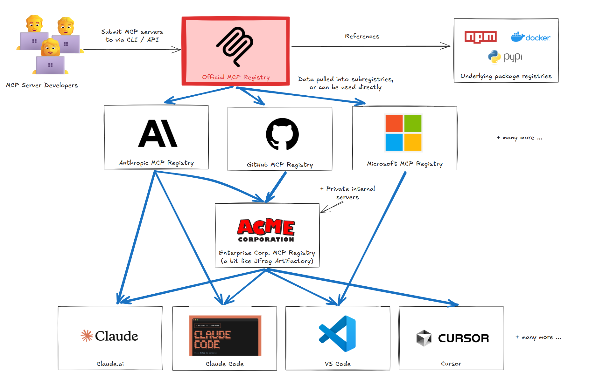
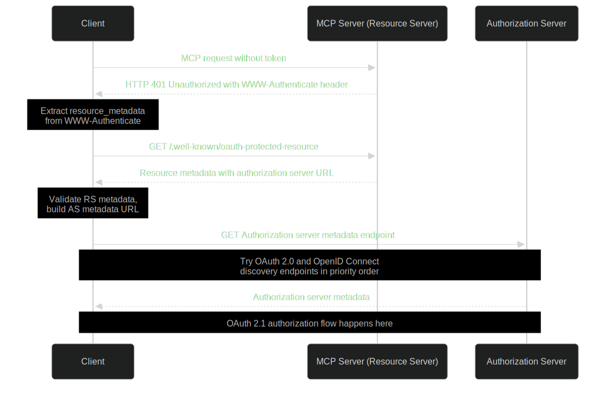
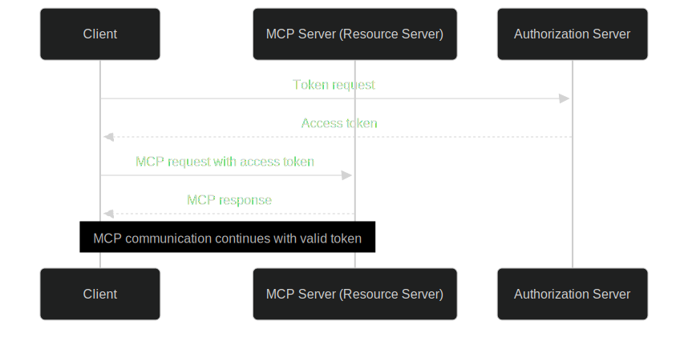

<!-- _class: lead -->

<style>
img[alt~="center"] {
  display: block;
  margin: 0 auto;
}
</style>

# MCP Landscape for Developers. Part II


---

<!-- _class: hero -->


## Oleksii Nikiforov

- Lead Software Engineer at EPAM Systems
- AI Coach
- +10 years in software development
- Open Source and Blogging
- <small>Someone who builds MCP Servers used in production 🙂</small>

> <i class="fa-brands fa-x"></i> [@nikiforovall](https://twitter.com/nikiforovall)
<i class="fa-brands fa-github"></i> GitHub: [nikiforovall](https://github.com/nikiforovall)
<i class="fa-brands fa-linkedin"></i> LinkedIn: [Oleksii Nikiforov](https://www.linkedin.com/in/nikiforov-oleksii/)
<i class="fa fa-window-maximize"></i> Blog: [nikiforovall.blog](https://nikiforovall.blog/)

---

# From Part I to Part II

<style scoped>
div {
  display: grid;
  place-items: center;
}
.mermaid {
  transform: scale(0.9);
  transform-origin: center;
}
section {
  font-size: 28px;
}
</style>

<div class="mermaid">
    %%{init: {
        'theme': 'dark',
        'themeVariables': {
            'fontSize': '16px',
            'primaryColor': '#1a1a2e',
            'primaryTextColor': '#ffffff',
            'primaryBorderColor': '#4a9eff',
            'lineColor': '#4a9eff',
            'secondaryColor': '#16213e',
            'tertiaryColor': '#0f3460'
        }
    }}%%
    mindmap
        root((MCP<br/>Landscape))
            🌐 Fundamentals<br/>✅ COVERED
                Protocol
                Client-Server
                Tools
            📦 Registry<br/> ⭐ TODAY
                Discovery
                Trust
            ✍️ Tool Design<br/>✅ COVERED
                Agent-First
                Consolidation
                Token Efficiency
            🛠️ .NET<br/>✅ COVERED
                Templates
                Stdio/HTTP
            🔒 Security<br/>⭐ TODAY
                OAuth 2.1
                Auth
            🤖 Agents<br/>⭐ TODAY
                MS Framework
                AI Foundry
</div>

---

# Agenda

<style scoped>
section {
  font-size: 42px;
}
</style>

- **MCP Registry: The App Store for Servers**
- **Securing MCP Servers with OAuth2.1**
- **Building Authenticated MCP Servers with .NET**
- **MCP in Agentic Systems**

---
<!-- _class: lead -->

# MCP Discovery


---

# The Fragmentation Problem

<style scoped>
section {
  font-size: 34px;
}
</style>

### **Too Many Places to Search**

Before the official registry, developers had to check multiple sources:

- 📦 [mcpservers.org](https://mcpservers.org/)
- 🐳 [hub.docker.com/mcp](https://hub.docker.com/mcp)
- 🌐 [mcp.so](https://mcp.so/)
- 💻 [github.com/mcp](https://github.com/mcp)
- 🔍 Various community catalogs and lists

**Problem**: No single source of truth, no standardization, no trust model

<!-- show different servers remote vs local (stdio), explain the difference -->

<!-- spend some time and demonstrate examples of good mcp servers: markitdown, browsertools, playwright, context7, microsoft docs -->

---

# MCP Registry: The App Store for Servers

<style scoped>
section {
  font-size: 36px;
}
</style>

> **"An app store for MCP servers"** - Centralized discovery for the MCP ecosystem

</br>

* **Discovery**: Find available MCP servers across the ecosystem
* **Trust & Validation**: GitHub OAuth, DNS verification, domain ownership
* **Status**: 🆕 Preview Release (September 2025)

<!-- https://github.com/modelcontextprotocol/registry?tab=readme-ov-file -->

---

# Why We Need the Registry

<style scoped>
section {
  font-size: 28px;
}
</style>

❌ Without a registry, developers face:
- **Fragmentation**: Servers scattered across repositories
- **No Trust Model**: Can't verify server authenticity
- **Naming Conflicts**: Multiple servers with same identifiers
- **Poor Discoverability**: Hard to find what you need

### **The Solution**

A centralized, secure registry that:
- ✅ Makes servers **easily discoverable**
- ✅ Ensures **authenticity and trust**
- ✅ Manages **namespaces** to prevent conflicts
- ✅ Accelerates **ecosystem growth**

---

# Registry Architecture

<style scoped>
div {
  display: grid;
  place-items: center;
}
.mermaid {
  transform: scale(1.1);
  transform-origin: center;
}
</style>

<div class="mermaid">
    %%{init: {
        'theme': 'dark',
        'themeVariables': {
            'fontSize': '28px',
            'primaryTextColor': '#ffffff'
        },
        'flowchart': {
            'nodeSpacing': 200,
            'rankSpacing': 100
        }
    }}%%
    flowchart TD
        Developer -->|Publish| Registry
        MCPClient -->|Discover| Registry
        MCPClient -->|Connect| MCPServer1
        MCPClient -->|Connect| MCPServer2
</div>

---



---

# MCP Registry in Action

<style scoped>
section {
  font-size: 30px;
}
</style>

`GET /v0.1/servers` - List all servers with pagination
`GET /v0.1/servers/{serverName}/versions` - List all versions of a server
`GET /v0.1/servers/{serverName}/versions/{version}` - Get specific version of server.

<br/>

Get a list of registered MCP servers:

```bash
curl "https://registry.modelcontextprotocol.io/v0/servers?limit=3" | jq .servers[].server
```

<br/>

##### Example of MCP Registry Client

🔗 **[teamsparkai.github.io/ToolCatalog](https://teamsparkai.github.io/ToolCatalog/)**

<!-- https://blog.modelcontextprotocol.io/posts/2025-09-08-mcp-registry-preview/ -->

---

# Publish Your MCP Server

1️⃣ Initialize the `server.json` file:
```bash
mcp-publisher init
```

2️⃣ Edit the `server.json` file to define your server (next slide).

3️⃣ Login via GitHub OAuth
```bash
mcp-publisher login github
```

4️⃣ Publish the server
```bash
mcp-publisher publish
# ✓ Successfully published
```

---

# Edit the generated server.json

```json
{
  "$schema": "https://static.modelcontextprotocol.io/schemas/2025-10-17/server.schema.json",
  "name": "io.github.username/azure-devops-mcp",
  "title": "Azure DevOps",
  "description": "Manage Azure DevOps work items and pipelines",
  "version": "1.0.0",
  "packages": [
    {
      "registryType": "nuget",
      "identifier": "Username.AzureDevOpsMcp",
      "version": "1.0.0",
      "transport": {
        "type": "stdio"
      }
    }
  ]
}
```

---

# Q&A

<style scoped>
div {
  display: grid;
  place-items: center;
}
.mermaid {
  transform: scale(1.0);
  transform-origin: center;
}
section {
  font-size: 32px;
}
</style>

<div class="mermaid">
    %%{init: {
        'theme': 'dark',
        'themeVariables': {
            'fontSize': '24px',
            'primaryColor': '#1a1a2e',
            'primaryTextColor': '#ffffff',
            'primaryBorderColor': '#4a9eff',
            'lineColor': '#4a9eff',
            'secondaryColor': '#16213e',
            'tertiaryColor': '#0f3460'
        }
    }}%%
    mindmap
        root((Registry))
            🔎 Discovery
                Centralized
                Single Source of Truth
            ✔️ Validation
                GitHub OAuth
                DNS Verification
                Domain Ownership
            📝 Publishing
                mcp-publisher CLI
                server.json Config
                API Integration
</div>

---

<!-- _class: lead -->

# Securing MCP Servers with OAuth2.1


---

# MCP Security Fundamentals

<style scoped>
section {
  font-size: 28px;
}
</style>

> "When building on top of a fast-paced technology like MCP, **it's key** that you start with security as a foundation, not an afterthought."

### **Why Security Matters**
* MCP servers act as **bridges between AI agents and data sources**
* Security breaches can:
  * Compromise sensitive data
  * Manipulate AI behavior and decision-making
  * Lead to unauthorized access to connected systems

### **Key Security Principles**
* 🔒 **Defense in Depth**: Multiple layers of security controls
* 🎯 **Least Privilege**: Minimal access rights for users and systems
* 📊 **Observability**: Comprehensive logging and monitoring

---
# Template Installation

```bash
dotnet new install Nall.ModelContextProtocol.Template

# Template Name         Short Name            Language  Tags
# --------------------  --------------------  --------  -------------
# MCP Server            mcp-server            [C#]      dotnet/ai/mcp
# MCP Server HTTP       mcp-server-http       [C#]      dotnet/ai/mcp
# MCP Server HTTP Auth  mcp-server-http-auth  [C#]      dotnet/ai/mcp
# MCP Server Hybrid     mcp-server-hybrid     [C#]      dotnet/ai/mcp
```

---

# Create new Project with Authentication Enabled

```bash
dotnet new mcp-server-http-auth -n MyFirstAuthMcp -o MyFirstAuthMcp --dry-run

#  Create: MyFirstAuthMcp\.vscode\mcp.json
#  Create: MyFirstAuthMcp\MyFirstAuthMcp.csproj
#  Create: MyFirstAuthMcp\Program.cs
#  Create: MyFirstAuthMcp\Properties\launchSettings.json
#  Create: MyFirstAuthMcp\README.md
#  Create: MyFirstAuthMcp\Tools\EchoTool.cs
#  Create: MyFirstAuthMcp\Tools\UserService.cs
#  Create: MyFirstAuthMcp\appsettings.Development.json
#  Create: MyFirstAuthMcp\appsettings.json
```

---

# Auth Server: Program.cs

```ts
var builder = WebApplication.CreateBuilder(args);

builder.Services.AddHttpContextAccessor();
builder.Services.AddScoped<UserService>();

builder
    .Services.AddAuthentication(options =>
    {
        options.DefaultAuthenticateScheme = JwtBearerDefaults.AuthenticationScheme;
        options.DefaultChallengeScheme = McpAuthenticationDefaults.AuthenticationScheme;
    })
    .AddMcp(options =>
    {
        var identityOptions = builder
            .Configuration.GetSection("AzureAd")
            .Get<MicrosoftIdentityOptions>()!;

        options.ResourceMetadata = new ProtectedResourceMetadata
        {
            Resource = GetMcpServerUrl(),
            AuthorizationServers = [GetAuthorizationServerUrl(identityOptions)],
            ScopesSupported = [$"api://{identityOptions.ClientId}/Mcp.User"],
        };
    })
    .AddMicrosoftIdentityWebApi(builder.Configuration.GetSection("AzureAd"));

builder.Services.AddMcpServer().WithToolsFromAssembly().WithHttpTransport();

var app = builder.Build();

app.UseAuthentication();
app.UseAuthorization();

app.MapMcp().RequireAuthorization();

// Run the web server
app.Run();
```

---
# Auth Server: EchoTool.cs

```csharp
[McpServerToolType]
public class EchoTool(UserService userService)
{
    [McpServerTool(
        Name = "Echo",
        Title = "Echoes the message back to the client.",
        UseStructuredContent = true
    )]
    [Description("This tool echoes the message back to the client.")]
    public EchoResponse Echo(string message) =>
        new($"hello {message} from {userService.UserName}", userService.UserName!);
}

public record EchoResponse(string Message, string UserName);
```

---
# Configure Azure AD App Registration

```json
{
  "AzureAd": {
    "Instance": "https://login.microsoftonline.com/",
    "Domain": "",
    "TenantId": "",
    "ClientId": "",
    "ClientSecret": ""
  },
  "McpServerUrl": "https://localhost:7000"
}
```

---

# Run It 🚀

Run the server:
```bash
dotnet run
```

Check it from the Inspector:

```bash
npx @modelcontextprotocol/inspector --transport http --server-url https://localhost:7000
```

But there is a better way - use VSCode `mcp.json` config:

```json
{
  "servers": {
    "echo-mcp": {"url": "https://localhost:7000", "type": "http"}
  }
}
```

---

# OAuth 2.1 Architecture Overview

<style scoped>
section {
  font-size: 26px;
}
</style>

### **Authorization Flow**
1. **Discovery Phase**: Unauthenticated access returns *metadata URL*
2. **Client Registration**: Dynamic client registration with authorization server. Some clients may be pre-registered ...
3. **User Consent**: User provides authorization and consent
4. **Token Exchange**:MCP client exchanges authorization code for access token.
5. **Authenticated requests**. All subsequent requests from MCP client to MCP server include `Bearer` token.

### **Key Components**
* **Protected Resource Metadata (PRM)**: OAuth 2.0 specification for resource protection. The MCP server must implement the `/.well-known/oauth-protected-resource`
* **Token Validation**: Verify user identity and permissions on every request

---

<style scoped>
section {
  padding-top: 0;
  margin-top: 0;
}
.mermaid {
  transform: scale(0.9);
  transform-origin: center;
}
</style>



---

<style scoped>
.mermaid {
  transform-origin: center;
}
</style>



---

# Q&A

<style scoped>
div {
  display: grid;
  place-items: center;
}
.mermaid {
  transform: scale(1.0);
  transform-origin: center;
}
section {
  font-size: 32px;
}
</style>

<div class="mermaid">
    %%{init: {
        'theme': 'dark',
        'themeVariables': {
            'fontSize': '24px',
            'primaryColor': '#1a1a2e',
            'primaryTextColor': '#ffffff',
            'primaryBorderColor': '#4a9eff',
            'lineColor': '#4a9eff',
            'secondaryColor': '#16213e',
            'tertiaryColor': '#0f3460'
        }
    }}%%
    mindmap
        root((Security))
            🛡️ Principles
                Defense in Depth
                Least Privilege
                Observability
            🔐 OAuth Flow
                Discovery Phase
                Client Registration
                User Consent
                Token Exchange
            🔧 Key Components
                PRM Endpoint
                Token Validation
            🛠️ .NET
                AddMcp
                Azure AD
                Bearer Token 
</div>

---

<!-- _class: lead -->

# MCP in Agentic Systems


---

# Microsoft Agent Framework and Azure AI Foundry

<style scoped>
section {
  font-size: 28px;
}
</style>

### **Microsoft Agent Framework**
* **Cross-platform**: .NET (C#) and Python support
* **Unified abstraction**: Common `AIAgent` base for all agent types
* **Multi-backend**: Azure OpenAI, OpenAI, Azure AI Foundry, Ollama, custom
* **Built-in features**: Function calling, multi-turn conversations, structured output, streaming
* **Workflows**: Type-safe orchestration of multiple agents and business processes

### **Azure AI Foundry**
* **Unified platform** for building, evaluating, and deploying AI agents
* **Server-side persistent agents** with **built-in MCP support**
* **Enterprise-ready**: Authentication, monitoring, compliance, scalability

---

# Building Agents with MCP Tools: Code Example

<style scoped>
section {
  font-size: 24px;
}
pre {
  font-size: 18px;
}
</style>

```csharp
// Get a client to create/retrieve server side agents with.
var client = new PersistentAgentsClient(endpoint, new AzureCliCredential());

// Create an MCP tool definition that the agent can use.
var mcpTool = new MCPToolDefinition(
    serverLabel: "microsoft_learn",
    serverUrl: "https://learn.microsoft.com/api/mcp"
);
mcpTool.AllowedTools.Add("microsoft_docs_search");

// Create a server side persistent agent with the Azure.AI.Agents.Persistent SDK.
PersistentAgent agent = await client.Administration.CreateAgentAsync(
    model: model,
    name: "MicrosoftLearnAgent",
    instructions: "You answer questions by searching Microsoft Learn content only.",
    tools: [mcpTool]
);
```


---

# Using the Agent: Code Example

<style scoped>
section {
  font-size: 24px;
}
pre {
  font-size: 16px;
}
</style>

```csharp
// Create a thread and send message
PersistentAgentThread thread = await client.Threads.CreateThreadAsync();
await client.Messages.CreateMessageAsync(thread.Id, MessageRole.User,
  """
  Please find what's new in .NET 10. Hint: Use the 'microsoft_docs_search' tool.
  """
);

// Configure MCP tool resources with approval settings
var mcpToolResource = new MCPToolResource(serverLabel: "microsoft_learn")
{
  RequireApproval = new MCPApproval("never")
};

// Run the agent
ThreadRun run = await client.Runs.CreateRunAsync(
  thread, agent,
  toolResources: mcpToolResource.ToToolResources());
```

**Result**: Agent automatically calls the MCP tool to search Microsoft Learn documentation

---
# Using the Agent: Output

<style scoped>
section {
  font-size: 24px;
}
pre {
  font-size: 16px;
}
</style>

```csharp
// Poll until the run is completed
do
{
    await Task.Delay(500);
    run = await client.Runs.GetRunAsync(thread.Id, run.Id);
} while (run.Status == RunStatus.Queued || run.Status == RunStatus.InProgress);

// Get the messages
Pageable<PersistentThreadMessage> messages = client.Messages.GetMessages(
    threadId: thread.Id, order: ListSortOrder.Ascending);

// Print out agent messages
foreach (PersistentThreadMessage threadMessage in messages)
{
  if (threadMessage.Role == MessageRole.Agent)
  {
    foreach (MessageContent content in threadMessage.ContentItems)
    {
        if (content is MessageTextContent textContent)
        {
            Console.WriteLine(textContent.Text);
        }
    }
  }
}
```

---

# Run It 🚀

```bash
dotnet run agent_03_foundry_mcp.cs
```

<br/>

> **Full example**: `samples/agent_03_foundry_mcp.cs`

---

# What We've Learned Today. Q&A

<style scoped>
div {
  display: grid;
  place-items: center;
}
.mermaid {
  transform: scale(0.95);
  transform-origin: center;
}
</style>

<div class="mermaid">
    %%{init: {
        'theme': 'dark',
        'themeVariables': {
            'fontSize': '20px'
        },
        'flowchart': {
            'nodeSpacing': 500,
            'rankSpacing': 0
        }
    }}%%
    mindmap
        root((Today))
            📦 MCP Registry
                Centralized Discovery
                Trust & Validation
            🔒 Security
                OAuth 2.1
                Authentication
            🛠️ Building with .NET
                MCP Server Template
                Stdio & HTTP Transports
            🤖 Agentic Systems
                Microsoft Agent Framework
                Azure AI Foundry
                MCP Integration
</div>

<script type="module">
import mermaid from 'https://cdn.jsdelivr.net/npm/mermaid@10/dist/mermaid.esm.min.mjs';
mermaid.initialize({ startOnLoad: true });

window.addEventListener('vscode.markdown.updateContent', function() { mermaid.init() });
</script>
